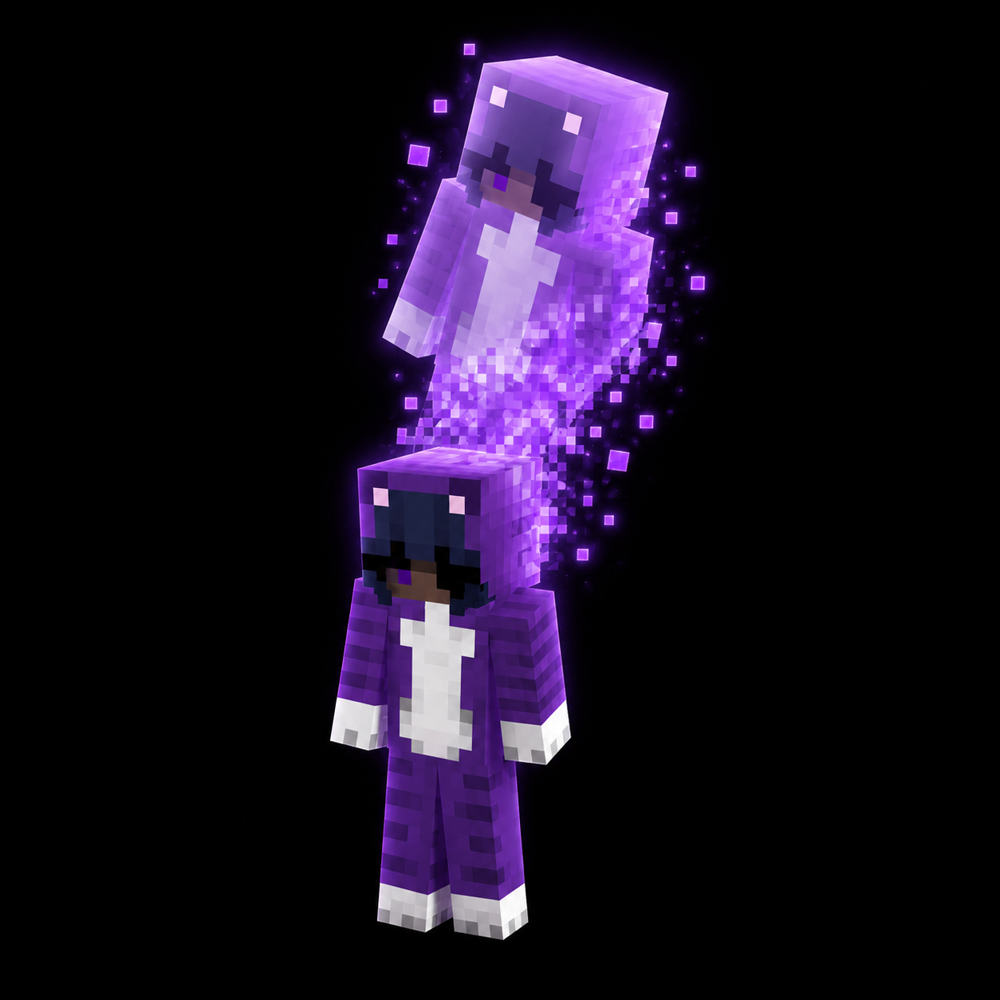
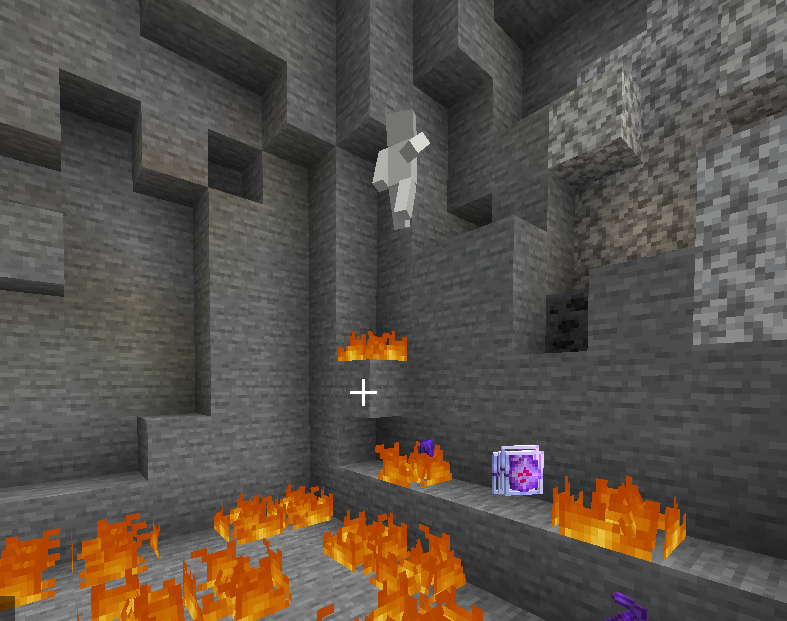
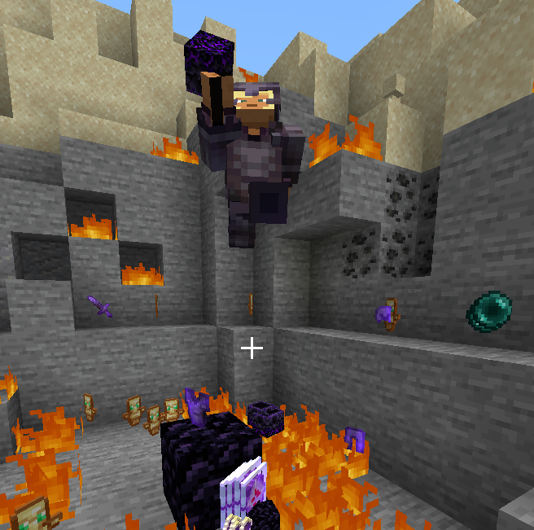
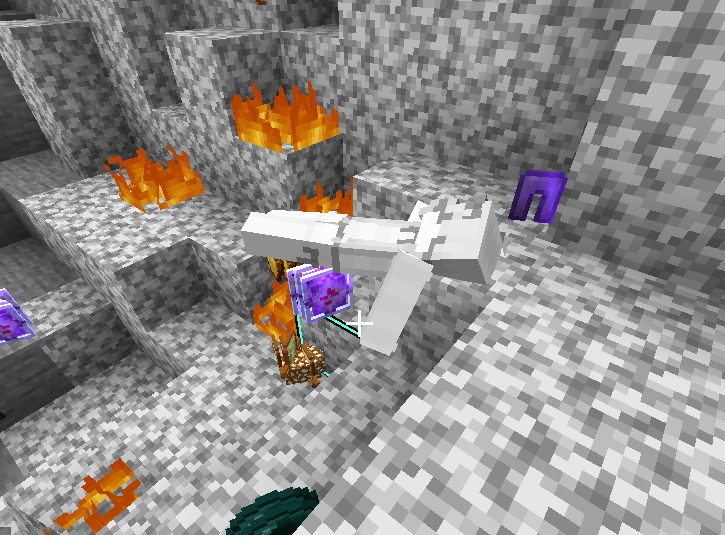
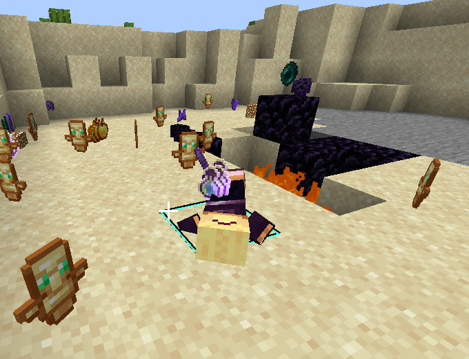
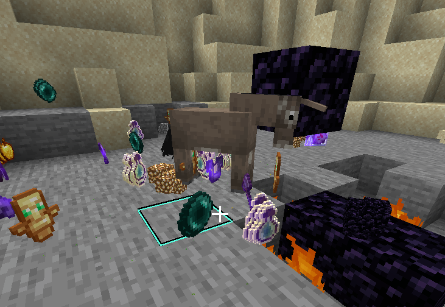

# KoHs Death Effects

[](https://discord.gg/9t2VxEF7UU)
[](https://github.com/kerlycanelita/KoHs-Death-Effects/issues)
[](LICENSE)

KoHs Death Effects is a client-side Fabric mod that replaces Minecraft's standard player death presentation with configurable, animated effects. Minecraft **1.21.11 is the canonical implementation**; every other folder under `versions/` is a maintained compatibility port.

> Mod de Fabric del lado del cliente con efectos de muerte configurables, previews 3D y soporte para Minecraft 1.21–1.21.11 y 26.1–26.2.



## Effect guide

### Silhouette

Creates a rising 3D silhouette from the dead player's skin. Its color, opacity, scale, duration and elevation can be configured. The menu preview uses the actual player skin with the selected color layer.



### Player Ghost

Shows the player's skin as a fading ghost. It supports rising or stationary movement and independent options for armor and held items.



### Faint

Turns the death into a physical fall or crawl animation. The preview uses a centered follow-camera viewport so the model remains visible throughout the animation.

<table>
  <tr>
    <td></td>
    <td></td>
  </tr>
  <tr>
    <td align="center">Fall</td>
    <td align="center">Crawl</td>
  </tr>
</table>

### Kids

Offers shoulder and train presentations. The configuration tab uses a dedicated reference image so both modes are immediately understandable.


### Morph

Replaces the player with a configurable mob presentation, including elevation, opacity and optional sound behavior.



## Compatibility

| Minecraft | Java | Role |
|---|---:|---|
| 1.21–1.21.10 | 21 | Maintained ports |
| 1.21.11 | 21 | Canonical source |
| 26.1–26.2 | 25 | Maintained ports |

The exact mappings, Fabric API and Mod Menu versions for all 16 targets are documented in [versions/MATRIX.md](versions/MATRIX.md).

## Installation

1. Install Fabric Loader for your Minecraft version.
2. Install the matching Fabric API build.
3. Put only the JAR matching your Minecraft version in the instance's `mods` folder.
4. Install Mod Menu to access the configuration screen easily.

Do not replace the mod JAR while Minecraft is running. Close the instance first to avoid a partially read ZIP/JAR.

## Configuration

Open **Mods → KoHs Death Effects → Configure**. Each effect has its own tab and live preview. Preview controls are responsive to the available GUI space:

- Left-drag rotates supported 3D previews.
- Mouse wheel changes preview zoom.
- Restart replays the current animation.
- Silhouette previews reflect the selected skin, color and opacity.

## Source layout

- `versions/1.21.11` — canonical implementation.
- `versions/<minecraft-version>` — API-specific ports.
- `versions/MATRIX.md` — dependency and verification matrix.
- Root images — README/gallery assets.

Changes should be implemented against 1.21.11 first, then adapted to the other API families. Compatibility code is intentionally kept inside each target so every version can be built independently.

## Building

Use the Java version listed in the compatibility table:

```powershell
cd versions/1.21.11
.\gradlew.bat clean build
```

The release JAR is written to `build/libs/kohs_death_effects-1.0.0+mc<version>.jar`.

## Support and bug reports

Join the community on [Discord](https://discord.gg/9t2VxEF7UU), or report reproducible bugs through [GitHub Issues](https://github.com/kerlycanelita/KoHs-Death-Effects/issues). Include:

- Minecraft version and mod JAR version
- Fabric Loader/Fabric API versions
- Selected death effect and relevant options
- `latest.log` or crash report
- Steps that reproduce the problem

## License

KoHs Death Effects is available under the [MIT License](LICENSE).
